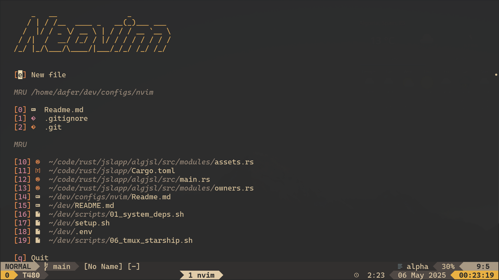
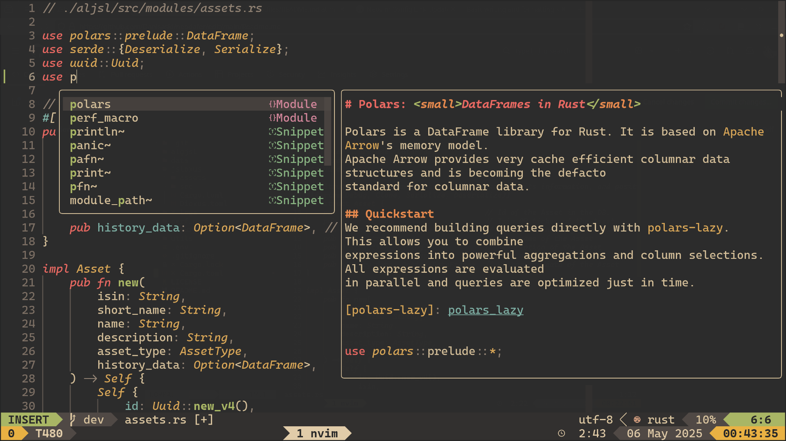
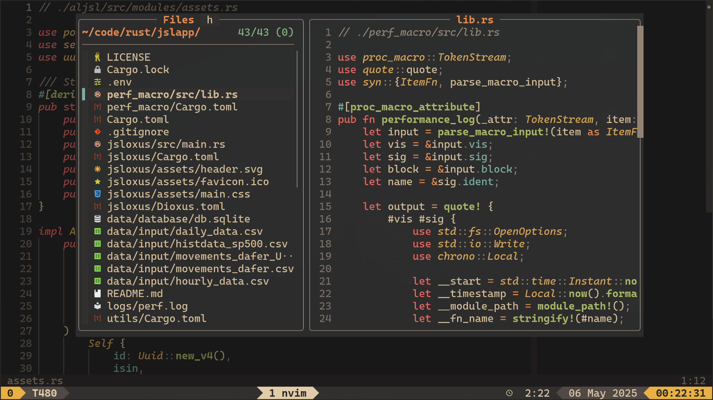
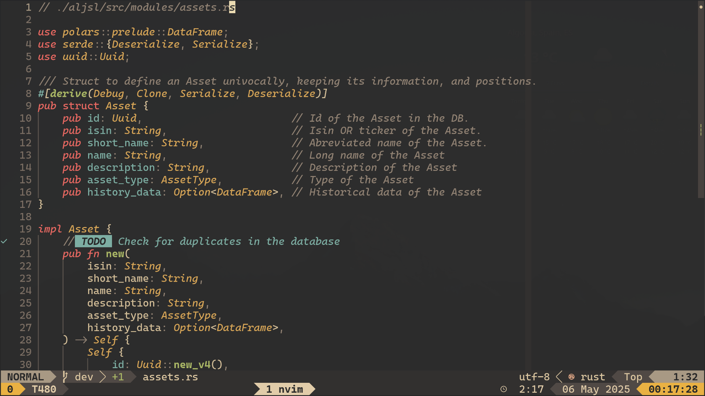
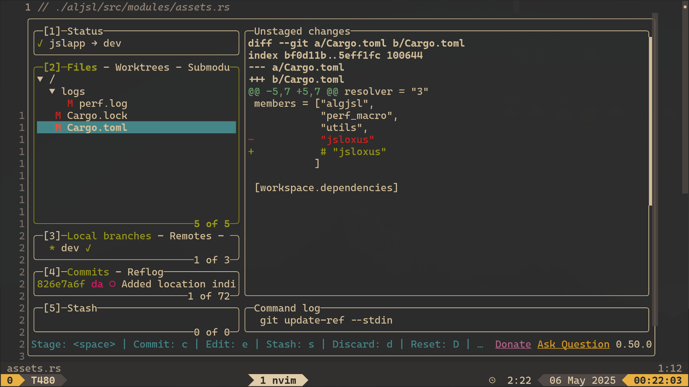

# Neodafer (custom neovim configuration lua files)

Files related to my neovim configuration. Installed along with [my other dotfiles](https://github.com/Danisaski/dotfiles).

### For standalone installation
```bash
git clone https://github.com/Danisaski/neodafer.git ~/.config/nvim
```
Or the slim version:
```bash
git clone -b slim https://github.com/Danisaski/neodafer.git ~/.config/nvim
```
or with SSH access
```bash
git clone git@github.com:Danisaski/neodafer.git ~/.config/nvim
```
```bash
git clone -b slim git@github.com:Danisaski/neodafer.git ~/.config/nvim
```

## Custom landing page using 'alpha-nvim'


## 'blink-cmp' for blazingly fast code completion and suggestions


## 'nvim-tree' with some tweaks


## 'fzf-lua' for fuzzy finding and navigating


## Matching colorscheme in all statuslines (Gruvbox Material)


## Running a Rust project by pressing `<leader>r`


## Some utils embedded (Lazygit)

